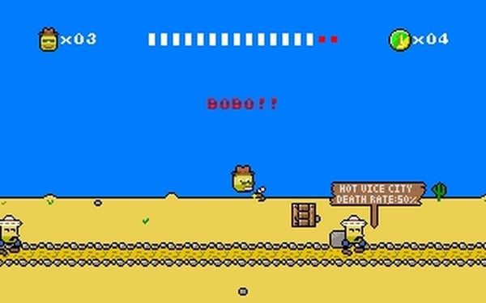

Mister Patate
=============

Mister Patate is a 2D platform with a Western theme where the main
character is a potato. The gameplay is inspired from the game
[Moktar](https://www.myabandonware.com/game/lagaf-les-aventures-de-moktar-vol-1-la-zoubida-17r). Mister
Patate was written for DOS in a mix of Pascale and assembly
language. I might rewrite it in OCaml one day.

